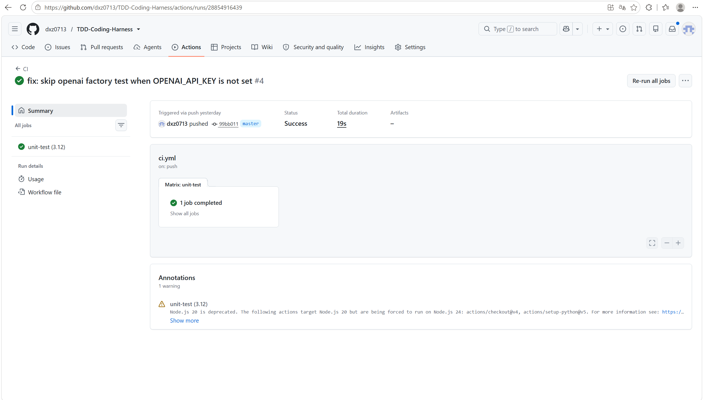

# TDD Coding Harness

一个教学导向的 **Coding Agent Harness**。它把 LLM 包装成可执行代码任务的工程系统，重点展示：主循环、工具分发、治理护栏、上下文、记忆、配置，以及基于测试结果的反馈修复闭环。

> **课程：** AI4SE 期末项目 · A 类 · Coding Agent Harness
>
> **主要贡献：** Feedback Engine，可扩展的测试反馈分析与修复提示生成机制

## CI 状态




*CI 最后一次执行结果截图：2026-07-08*

## 快速开始

### 环境要求

- Python 3.12+
- pip
- 可选：Docker Desktop / Docker Engine

### 安装

```bash
pip install -e ".[dev]"
```

### 离线冒烟测试

```bash
tdd-harness --help
tdd-harness demo
```

### 运行真实 API 任务

使用 OpenAI-compatible API 时，通过环境变量提供 API Key，不要写入仓库文件。

Linux / macOS:

```bash
export OPENAI_API_KEY="your-api-key"
tdd-harness run "编写一个计算斐波那契数列的函数" --provider openai --model deepseek-v4-pro
```

PowerShell:

```powershell
$env:OPENAI_API_KEY = "your-api-key"
tdd-harness run "编写一个计算斐波那契数列的函数" --provider openai --model deepseek-v4-pro
```

课程提供的 OpenAI-compatible endpoint 可通过本地配置文件使用：

```powershell
@"
version: 1

provider:
  name: openai
  model: deepseek-v4-pro
  base_url: https://njusehub.info/v1
  temperature: 0.0
  max_tokens: 4096
  timeout: 60

loop:
  max_iterations: 15
  workspace: ./workspace

guardrail:
  enabled: true
  block_list: []

memory:
  enabled: true
  path: output/memory.json
"@ | Set-Content -Encoding UTF8 config.local.yaml

tdd-harness run "编写一个计算斐波那契数列的函数" --config config.local.yaml
```

`config.local.yaml` 已被 `.gitignore` 排除，不会提交。

## 最终验证结果

### 单元测试

```bash
pytest tests/ -v
```

本地最终结果（2026-07-09）：

```text
213 passed, 1 skipped
```

### 真实 API 端到端验证

真实 API 调用已完成两次端到端任务：

```text
Task: 编写一个计算斐波那契数列的函数
SUCCESS - All tests passed
Iterations: 9
Generated artifacts: workspace/fib/fib.py, workspace/fib/test_fib.py
Captured CLI log: workspace/fib/log.txt

Task: 编写一个计算最大公因数的函数
SUCCESS - All tests passed
Iterations: 3
Generated artifacts: workspace/gcd/gcd.py, workspace/gcd/test_gcd.py
Captured CLI log: workspace/gcd/log.txt
```

`workspace/` 是真实 API 调用证据目录：

- `workspace/README.md`：证据目录说明
- `workspace/fib/`：Fibonacci 任务的代码、测试和 CLI 输出
- `workspace/gcd/`：GCD 任务的代码、测试和 CLI 输出

### Docker 验证

```bash
docker build -t tdd-harness .
docker run --rm tdd-harness --help
```

本地最终结果（2026-07-09）：

```text
docker build -t tdd-harness .        -> success
docker run --rm tdd-harness --help   -> success
```

镜像中包含 `config.yaml`，因此容器内可以解析默认 CLI 配置。容器内 mock run 会以 `FAILURE - LLM returned no tool calls` 退出，这是默认 `MockProvider` 没有工具调用时的预期行为。

### Web UI / Vercel

项目包含一个极简 FastAPI Web UI，位于 `webui/`，用于 Vercel 部署演示。Web UI 只是 CLI 的薄包装，不替代自实现的 harness 主循环。

本地 WebUI 健康检查（2026-07-09）：

```text
GET /      -> 200
POST /run  -> 200
```

Vercel 相关修复：

- 根目录 `app.py` 作为 Vercel Python runtime 默认入口
- `pyproject.toml` 声明 `[tool.vercel] entrypoint = "app:app"`
- 删除旧 `vercel.json` 的 `builds/routes` 配置，避免覆盖官方 Python runtime 入口
- `requirements.txt` / `pyproject.toml` 补齐 FastAPI 运行依赖
- 补充 `python-multipart`，修复 FastAPI 表单路由导入时报错导致的 500
- WebUI 改为内联 HTML，避免模板文件在 Vercel 函数包中缺失导致首页 500
- WebUI 子进程显式传入项目根 `config.yaml`

若线上旧部署仍返回 500，重新部署即可触发 GitHub 绑定的 Vercel 构建。

## 架构说明

整体流程：

```text
CLI -> Config -> ProviderFactory -> HarnessLoop -> Tools / Feedback / Guardrail
```

1. **CLI 层**：`harness/cli.py` 使用 Typer 实现 `run` 与 `demo` 命令。CLI 参数优先级高于配置文件。
2. **配置层**：`harness/config.py` 使用 Pydantic 加载 `config.yaml`，支持 `--provider`、`--model` 覆盖。
3. **Provider 层**：`providers/factory.py` 实现注册表工厂。内置 `MockProvider` 和 `OpenAICompatibleProvider`。
4. **主循环**：`harness/loop.py` 实现核心 agent loop：构建上下文、调用 LLM、解析工具调用、护栏检查、工具执行、反馈分析、停机判断。
5. **工具分发**：`tools/dispatcher.py` 将 LLM 的工具调用路由到 `ReadFile`、`WriteFile`、`RunShell`。
6. **治理护栏**：`harness/guardrail.py` 在 shell 命令执行前拦截危险动作，如 `rm -rf /`、fork bomb、破坏性数据库命令等。
7. **反馈引擎**：`feedback/` 是主要贡献，负责从测试输出中提取客观反馈并生成修复提示。
8. **上下文与记忆**：`harness/context.py` 管理消息上下文，`harness/memory.py` 提供 JSON 文件形式的跨会话记忆。

## Feedback Engine

Feedback Engine 的流水线：

```text
ToolResult -> Collector -> FailureAnalyzer -> RepairStrategy -> Feedback
```

它支持 7 类失败分析：

- `SyntaxError`
- `AssertionError`
- `ImportError`
- `RuntimeError`
- `Timeout`
- `TestFailure`
- `Unknown`

这些机制都可以在 MockProvider 下用确定性单元测试验证，满足课程要求中“机制必须是代码，而不是提示词”的约束。

## 配置说明

默认配置文件为 `config.yaml`：

```yaml
version: 1

provider:
  name: mock
  model: deepseek-v4-flash
  base_url: https://njusehub.info/v1
  temperature: 0.0
  max_tokens: 4096
  timeout: 30

loop:
  max_iterations: 15
  workspace: ./workspace

guardrail:
  enabled: true
  block_list: []

memory:
  enabled: true
  path: output/memory.json
```

配置优先级：

1. CLI 参数，如 `--provider`、`--model`
2. 配置文件，如 `config.yaml` / `config.local.yaml`
3. Pydantic 模型中的内置默认值

Provider 切换示例：

```bash
# 离线 mock
tdd-harness run "task description" --provider mock

# OpenAI-compatible API
tdd-harness run "task description" --provider openai --model deepseek-v4-pro

# 自定义配置文件
tdd-harness run "task description" --config config.local.yaml
```

## 机制演示

`examples/` 目录包含三个确定性演示脚本：

```bash
# 治理护栏：危险命令拦截
python examples/demo_guardrail.py

# 反馈分类：7 类失败类型识别
python examples/demo_feedback.py

# 完整 TDD 闭环：MockProvider 下的自主修复周期
python examples/demo_autonomous_repair.py
```

## 项目结构

```text
├── src/
│   ├── feedback/                 # Feedback Engine，核心贡献
│   ├── harness/                  # Harness 主循环、配置、上下文、护栏、记忆
│   ├── providers/                # LLM Provider 抽象、Mock、OpenAI-compatible 实现
│   ├── tests/                    # 源码侧测试套件
│   └── tools/                    # read_file / write_file / run_shell 工具
├── examples/                     # 机制演示脚本
├── app.py                        # Vercel Python runtime 入口
├── webui/                        # FastAPI Web UI，用于 Vercel 部署演示
├── workspace/                    # 真实 API 调用证据目录
│   ├── README.md
│   ├── fib/
│   │   ├── fib.py
│   │   ├── test_fib.py
│   │   └── log.txt
│   └── gcd/
│       ├── gcd.py
│       ├── test_gcd.py
│       └── log.txt
├── tests/                        # 顶层 pytest tests/ 兼容入口
├── docs/                         # SPEC、PLAN、过程文档
├── plan/                         # 课程要求与项目计划
├── config.yaml                   # 默认配置
├── Dockerfile                    # Docker 构建文件
├── pyproject.toml                # 项目元数据、依赖、pytest/Vercel 配置
├── AGENT_LOG.md                  # 开发与验证日志
├── REFLECTION.md                 # 项目反思
└── README.md
```

## 设计决策

### 为什么不使用 LangGraph / CrewAI / AutoGen？

课程要求交付的是自己编码实现的 harness 内核，而不是基于现成 agent 编排框架的配置层。因此本项目自行实现：

- agent 主循环
- Provider 抽象
- Tool Dispatcher
- Guardrail
- Feedback Engine
- Stop Condition
- Memory Store

### 为什么 Web UI 很薄？

核心交付物是 CLI harness。Web UI 只作为部署和展示入口，最终仍调用同一套 CLI 与 harness 代码，不引入第二套 agent runtime。

## 安全说明

- API Key 通过 `OPENAI_API_KEY` 环境变量或本地 `.env` 提供。
- `.env`、`config.local.yaml` 被 `.gitignore` 排除。
- 不要把真实 API Key 写入源码、文档或日志。
- `workspace/fib/log.txt` 与 `workspace/gcd/log.txt` 已检查，不包含真实 API Key。
- Guardrail 会在执行 shell 前拦截危险命令。

API Key 配置方式：

| 等级 | 方式 | 说明 |
|------|------|------|
| 推荐 | 系统钥匙串 | 可通过 `keyring` 接入 Windows Credential Manager / macOS Keychain |
| 常用 | `.env` 文件 | 明文文件，必须确认被 `.gitignore` 排除 |
| 临时 | 环境变量 | 适合一次性验证，如 PowerShell `$env:OPENAI_API_KEY="..."` |
| 禁止 | 硬编码 | 不得在源码、配置或提交记录中写入真实 Key |

## 已知限制

- 目前只实现 OpenAI-compatible Provider，未实现 Anthropic Claude Provider。
- Feedback Analyzer 主要针对 pytest 输出，其他测试框架未做专门适配。
- Memory 是 JSON 文件实现，生产级场景应替换为数据库或向量检索存储。
- Windows / Linux shell 差异可能影响 `RunShell` 的具体命令行为。
- Web UI 是展示层，不提供复杂任务管理、权限控制或多用户隔离。
